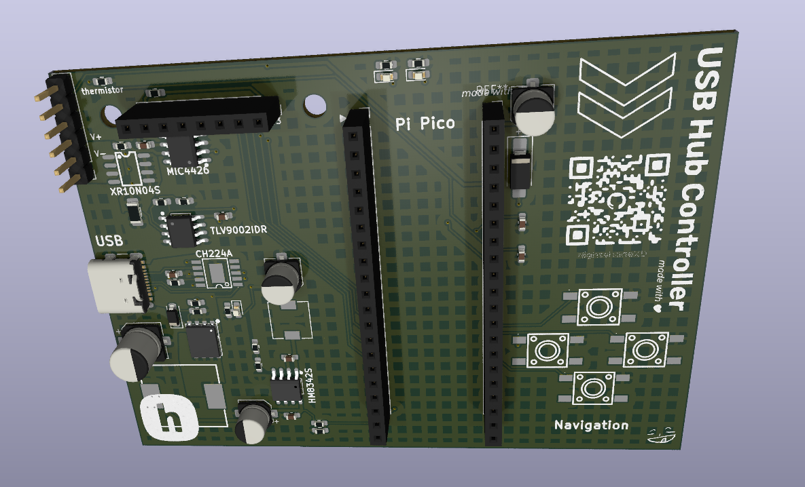
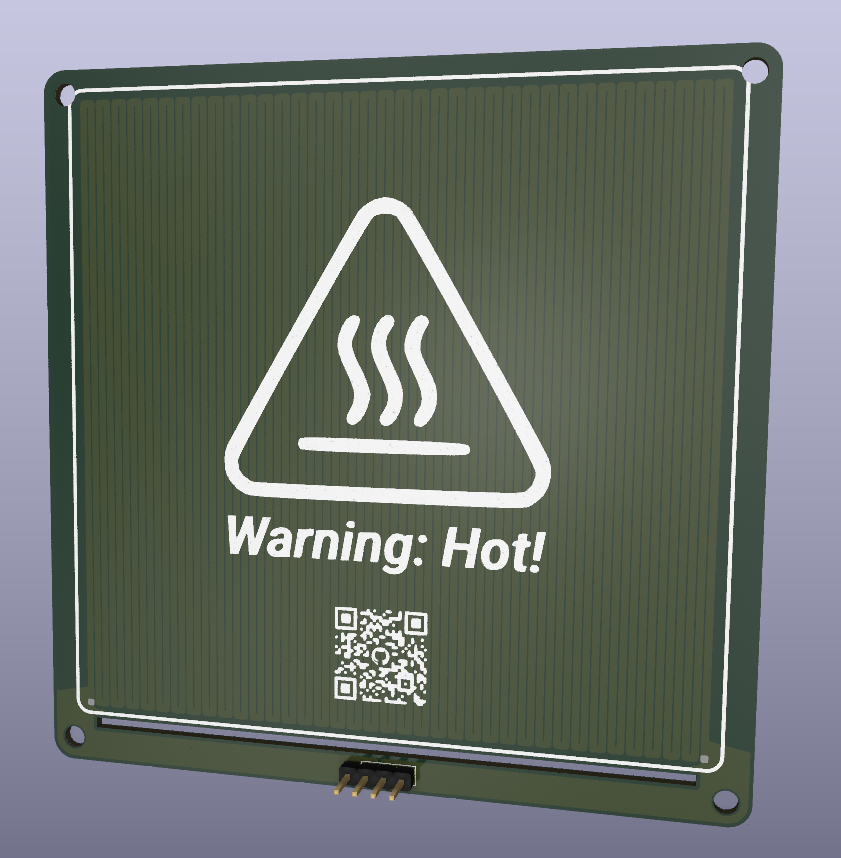

<h1 align="center">
  PCB Hot Plate
   
</h1>

<h4 align="center">
A 140W universal USB-C powered PCB Hot Plate!
</h4>
 

| Controller                                     | Heating Element                                      |
| ---------------------------------------------- | ---------------------------------------------------- |
|  |  |

## Description

A 140W USB-C-powered PCB hot plate for precise heating, such as for solder reflow. It uses a USB-C power input for accessibility and uses an aluminium PCB heating element driven a switching MOSFET, along with thermistors to monitor temperature, USB-C negotiation, and real-time current/voltage monitoring.

## Motivation

My motivation for this project was to create a low-cost, customizable, fully controllable PCB hotplate for electronics work, like soldering or heating stuff up. I thought that other hotplates online were very expensive and lacked the power I wanted. By designing a custom solution, I made a new hot plate capable of higher wattage (140W) and better flexibility.

## Features

- Powered by the pi pico
- Supports 140W (28V, 5A) from USB-C
- Compatible with any usb-c device
- 1.8 inch LCD screen
- 4 buttons to control
- LEDS for visualization
- Seperated heating element and controller for ease of replacement
- Temperature control

## BOM

| Name                                                                                                       | Purpose                                                      | Quantity | Total Cost (USD) | Link                                                 | Distributor               |
| ---------------------------------------------------------------------------------------------------------- | ------------------------------------------------------------ | -------- | ---------------- | ---------------------------------------------------- | ------------------------- |
| 1.8in LCD Screen                                                                                           | See navigation + temp + UI                                   | 1        | 3.79             | https://www.aliexpress.us/item/3256811557250210.html | Aliexpress                |
| 2.54mm Pin Headers - Male                                                                                  | Fill in the 1x6 and the 1x4 pin headers                      | 1        | 4.19             | https://www.aliexpress.us/item/3256806547306536.html | Aliexpress                |
| 2.54mm Pin Headers - Female                                                                                | Breakaway headers to fill in the 1x8 spot for the LCD Screen | 1        | 4.66             | https://www.aliexpress.us/item/3256806547306536.html | Aliexpress                |
| PCB Heating Element                                                                                        | The actual heating element to heat it up.                    | 10       | 5.00             |                                                      | JLCPCB                    |
| Controller PCB                                                                                             | The actual fr-4 pcb to control all of this                   | 10       | 5.00             |                                                      | JLCPCB                    |
| Diode Independent 40V 3A Surface Mount SMA(DO-214AC)                                                       |                                                              | 20       | 0.66             |                                                      | GOODWORK                  |
| 1uF ±10% 50V Ceramic Capacitor X5R 0603                                                                    |                                                              | 50       | 0.39             |                                                      | Samsung Electro-Mechanics |
| 100nF ±10% 50V Ceramic Capacitor X7R 0603                                                                  |                                                              | 100      | 0.31             |                                                      | YAGEO                     |
| 22uF ±20% 35V Aluminum Electrolytic Capacitors 2000hrs@105℃                                                |                                                              | 40       | 1.28             |                                                      | KNSCHA                    |
| 49.9kΩ ±1% 100mW 0603 Thick Film Resistor                                                                  |                                                              | 100      | 0.15             |                                                      | UNI-ROYAL                 |
| 100uF ±20% 35V Aluminum Electrolytic Capacitors 2800hrs@105℃                                               |                                                              | 20       | 0.78             |                                                      | DMBJ                      |
| 5pA 2 2V/us 1MHz Rail-to-Rail Input, Rail-to-Rail Output SOIC-8 Instrumentation, Op Amps, Buffer Amps RoHS |                                                              | 10       | 1.18             |                                                      | TI                        |
| Buck Switching Regulator IC Adjustable 0.8V~24V 1 Output 2A SOP-8-EP                                       |                                                              | 10       | 1.19             |                                                      | GATEMODE                  |
| 5V~18V 1.5A SOIC-8 Gate Drivers RoHS                                                                       |                                                              | 10       | 3.12             |                                                      | Tokmas                    |
| 3A 6.8uH ±20% 40mΩ 3.3A Magnetic Shielded Inductor SMD,6x6mm                                               |                                                              | 10       | 0.37             |                                                      | GUDIAN                    |
| 100mW 56kΩ 75V Thick Film Resistor ±1% 0603                                                                |                                                              | 100      | 0.16             |                                                      | YAGEO                     |
| 210kΩ ±1% 100mW 0603 Thick Film Resistor                                                                   |                                                              | 100      | 0.15             |                                                      | UNI-ROYAL                 |
| 82kΩ ±1% 100mW 0603 Thick Film Resistor                                                                    |                                                              | 100      | 0.11             |                                                      | FOJAN                     |
| 100mW 1kΩ 75V Thick Film Resistor ±1% 0603                                                                 |                                                              | 100      | 0.15             |                                                      | YAGEO                     |
| 10mΩ 1W ±1% 1206 Chip Resistor                                                                             |                                                              | 10       | 0.47             |                                                      | JIERR                     |
| 10Ω ±1% 100mW 0603 Thick Film Resistor                                                                     |                                                              | 100      | 0.10             |                                                      | FOJAN                     |
| 100mW 10kΩ 75V Thick Film Resistor ±1% 0603                                                                |                                                              | 100      | 0.15             |                                                      | YAGEO                     |
| 5.1kΩ ±1% 100mW 0603 Thick Film Resistor                                                                   |                                                              | 100      | 0.12             |                                                      | FOJAN                     |
| 100mW 330Ω 75V Thick Film Resistor ±1% 0603                                                                |                                                              | 100      | 0.15             |                                                      | YAGEO                     |
| P-Channel 40V 25A Surface Mount PDFN5060-8L                                                                |                                                              | 10       | 1.06             |                                                      | XNRUSEMI                  |
| N-Channel 40V 10A Surface Mount SOP-8                                                                      |                                                              | 10       | 0.77             |                                                      | XNRUSEMI                  |
| 10A 22uH ±20% SMD Inductor                                                                                 |                                                              | 10       | 3.22             |                                                      | XR                        |
| Tactile Switch SPST 180gf 6mm x 6mm SMD                                                                    |                                                              | 40       | 2.28             |                                                      | Yuandi                    |
| Female Header 20 Position 2.54mm Pitch                                                                     |                                                              | 20       | 2.25             |                                                      | HanElectricity            |
| USB-C Receptacle Connector 16 Position SMD                                                                 |                                                              | 10       | 1.85             |                                                      | Korean Hroparts Elec      |
| Zener Diode 15V 500mW SOD-123                                                                              |                                                              | 50       | 0.73             |                                                      | MDD                       |
| Emerald Green LED 0603                                                                                     |                                                              | 100      | 0.61             |                                                      | YONGYUTAI                 |
